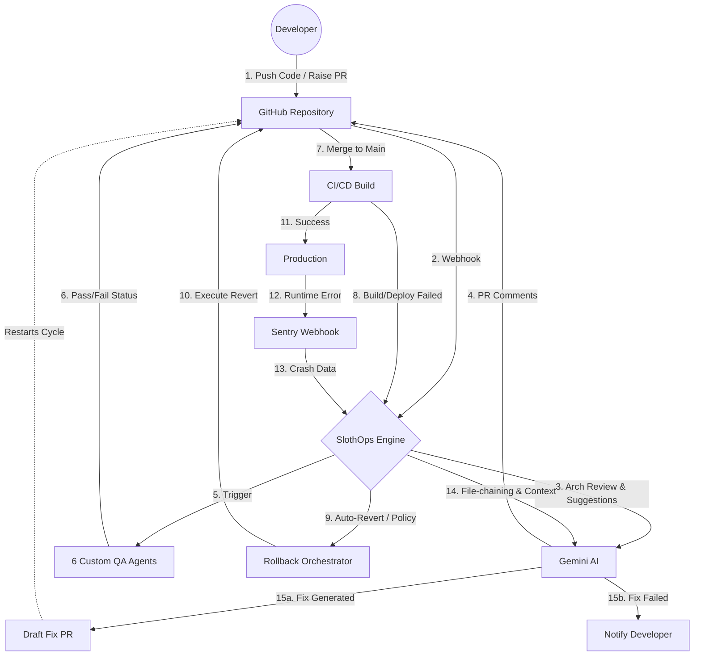

<div align="center">

# SlothOps Engine

**A closed-loop, production-aware automation engine that converts live application crashes into reviewed code fixes.**

[](https://www.python.org/)
[](https://fastapi.tiangolo.com/)
[](https://www.postgresql.org/)
[](https://react.dev/)
[](https://docs.docker.com/compose/)
[](LICENSE)

[Live API Docs →](http://localhost:8000/api/docs) · [API Reference](#api-reference) · [Developer Guide](docs/DEVELOPER_GUIDE.md) · [Contributing](#contributing)

</div>

---

## What is SlothOps?

SlothOps watches your production environment and acts on it — automatically and with human oversight where you want it.

When an exception fires in Sentry, SlothOps:

1. Receives the webhook, deduplicates and fingerprints the issue
2. Fetches the exact source code from GitHub
3. Generates a targeted fix via a configurable LLM provider chain
4. Opens a pull request with the fix and explanation
5. Runs **6 automated QA agents** (static analysis, functionality, regression, performance, stress, VAPT) against the fix PR
6. If a deployment fails, plans or executes a governed rollback — auto or approval-gated, depending on your policy

A React dashboard gives operators live visibility over every issue, PR, QA report, and rollback event.

---

## Architecture



---

## Quick Start

### Prerequisites

- [Docker Desktop 27+](https://www.docker.com/products/docker-desktop/) with Compose v2
- (Optional) A GitHub App + Sentry webhook secret for the full pipeline. The engine runs fine without them.

### One-command spin-up

```bash
git clone https://github.com/your-org/slothops-engine
cd slothops-engine
cp .env.example .env      # fill in keys (all optional for local exploration)
docker compose up --build
```

Then open **http://localhost:8000** for the Midnight Onyx landing page and dashboard, **http://localhost:8000/docs** for local spin-up docs, and **http://localhost:8000/api/docs** for the API explorer.

### Verify it works

```bash
# Health check
curl http://localhost:8000/health

# Create an account
curl -X POST http://localhost:8000/api/auth/signup \
  -H 'content-type: application/json' \
  -d '{"email":"you@example.com","password":"hunter2","workspace_name":"demo"}'

# Store the token and hit the dashboard
export TOKEN=<access_token>
curl http://localhost:8000/api/dashboard/overview \
  -H "authorization: Bearer $TOKEN"
```

---

## Dev Mode (fast iteration)

Run Postgres in Docker; the engine and React dev server run on the host with hot reload.

```bash
# Terminal 1 — Postgres only
docker compose up -d postgres

# Terminal 2 — Engine with auto-reload
source venv/bin/activate
pip install -r requirements.txt
alembic upgrade head
uvicorn main:app --reload --port 8000

# Terminal 3 — React dev server (proxies /api/* to :8000)
cd web && bun install && bun run dev
# Open http://localhost:5173
```

See [docs/DEVELOPER_GUIDE.md](docs/DEVELOPER_GUIDE.md) for a full codebase walkthrough.

---

## Configuration

Copy `.env.example` to `.env`. All keys are optional for local exploration — missing providers are skipped gracefully.

| Variable | Purpose | Required |
|---|---|---|
| `DATABASE_URL` | asyncpg URL for runtime queries | Yes |
| `DIRECT_DATABASE_URL` | psycopg URL for Alembic | Yes |
| `JWT_SECRET` | Signing key for dashboard JWTs | Yes |
| `GITHUB_APP_ID` | GitHub App numeric ID | For PR/webhook flows |
| `GITHUB_APP_PRIVATE_KEY` | PEM contents or path to `.pem` | For PR/webhook flows |
| `GITHUB_WEBHOOK_SECRET` | HMAC secret for `/webhook/github` | For PR/webhook flows |
| `LLM_PROVIDER_CHAIN` | Comma-separated provider list, tried in order | For fix generation |
| `GROQ_API_KEY` / `TOGETHER_API_KEY` / … | One key per provider | For fix generation |
| `SMTP_HOST` / `SMTP_USER` / `SMTP_PASS` | Email notifications | Optional |
| `BASE_URL` | Public URL used when registering Sentry webhooks | Optional |

---

## API Reference

The full interactive reference is at **http://localhost:8000/api/docs** (Swagger UI) once the stack is running. Key endpoint groups:

| Group | Base path | What |
|---|---|---|
| Auth | `/api/auth/` | Signup, login, session, workspace list |
| Dashboard | `/api/dashboard/` | Overview, metrics, activity, repos, health |
| Repos | `/api/repos/` | Policy upsert, preflight checks |
| QA Reports | `/api/qa-reports/` | List, detail, bypass, LLM-resolve |
| Rollbacks | `/api/rollbacks/` | Queue, detail, approve |
| Health | `/health`, `/api/health/` | Liveness, engine, LLM probe |
| Webhooks | `/webhook/sentry/`, `/webhook/github` | Inbound event receivers |

---

## The Continuous Lifecycle

SlothOps isn't just an error handler—it's deeply integrated into the entire Software Development Life Cycle (SDLC):

### 1. Development & QA
```text
Dev pushes code → GitHub PR opened → SlothOps performs architectural review
  → 6 QA agents run concurrently (VAPT, Stress, Regression, etc.)
  → Commits status is set (merge allowed or blocked)
```

### 2. Deployment & Rollback (Pre-Prod)
```text
PR merged → CI/CD deployment begins
  → If deployment fails (GitHub deployment_status webhook):
  → SlothOps Rollback Orchestrator kicks in (auto-reverts or creates rollback PR)
```

### 3. Production Remediation (Sentry)
```text
Deployment succeeds → Application runs in production
  → Unhandled exception occurs → Sentry fires webhook
  → SlothOps deduplicates, fetches call-chain context, and invokes the LLM
```

### 4. Auto-Fix Loop
```text
LLM successfully generates fix → Draft PR is created
  → The cycle restarts at Step 1 for the new fix PR!
(If the LLM fails to find a fix, a detailed report is sent back to the developer).
```

---

## Contributing

SlothOps is open source and welcomes contributions.

### Quick contribution checklist

1. Fork the repo and create a branch: `git checkout -b feat/my-feature`
2. Make a focused change — one PR per concern
3. Add or update tests in `tests/` (no external services needed for most tests)
4. Run `pytest -x tests/` — confirm no regressions
5. Open a PR with a clear description of *what* changed and *why*

### Adding features — entry points

| Feature type | Where to add code |
|---|---|
| New HTTP endpoint | `app/api/<resource>.py` + register in `main.py` |
| New pipeline | `app/pipelines/<name>.py` + wire in `app/api/webhooks.py` |
| New QA agent | `app/qa_agents/<name>.py` + add to `app/pipelines/qa_pipeline.py` |
| New LLM provider | `app/llm/client.py` → add `ProviderConfig` entry |
| New database model | `app/db/models.py` + `alembic revision --autogenerate` |

See [docs/DEVELOPER_GUIDE.md](docs/DEVELOPER_GUIDE.md) for a complete walkthrough of every file and how to extend each subsystem.

---

## Repo Layout

```
slothops-engine/
├── main.py                    FastAPI entry (the only Python file at root)
├── app/
│   ├── api/                   HTTP routers (auth, dashboard, repos, qa, rollbacks, health, webhooks)
│   ├── core/                  config, security, deps
│   ├── services/              aggregation / business logic
│   ├── schemas/               Pydantic view models
│   ├── models.py              domain models + enums
│   ├── auth.py / database.py / sse_manager.py / policy.py
│   ├── db/                    SQLModel ORM + CRUD + async engine
│   ├── pipelines/             orchestrators (pipeline, qa_pipeline, rollback, resolution…)
│   ├── integrations/          GitHub App, GitHub automation, Sentry parser, webhook security
│   ├── llm/                   provider client, fix generator, classifier
│   ├── code_analysis/         code fetcher, fingerprint, redactor, stack detector…
│   └── qa_agents/             6 QA agents
├── alembic/                   migrations
├── tests/                     pytest suite
├── web/                       React 18 + Vite dashboard
├── Dockerfile                 multi-stage: bun build → python runtime
└── docker-compose.yml         postgres + engine
```

---

## Troubleshooting

| Symptom | Likely cause |
|---|---|
| `alembic upgrade head` errors on container start | Postgres healthcheck didn't pass — `docker compose up --build --force-recreate` |
| Dashboard is blank after Docker build | `web-builder` stage failed silently — `docker compose build --no-cache engine` |
| `401 Invalid token` on every request | `JWT_SECRET` changed between sessions — sign out and back in |
| `Could not fetch repos` | `GITHUB_APP_ID` / `GITHUB_APP_PRIVATE_KEY` not set, or App not installed on the org |
| Sentry webhook returns 401 | `SENTRY_WEBHOOK_SECRET` in the Integration row doesn't match the Sentry header |

---

## License

MIT — see [LICENSE](LICENSE).

---

<div align="center">
  <sub>Slow is smooth. Smooth is fast. 🦥</sub>
</div>
