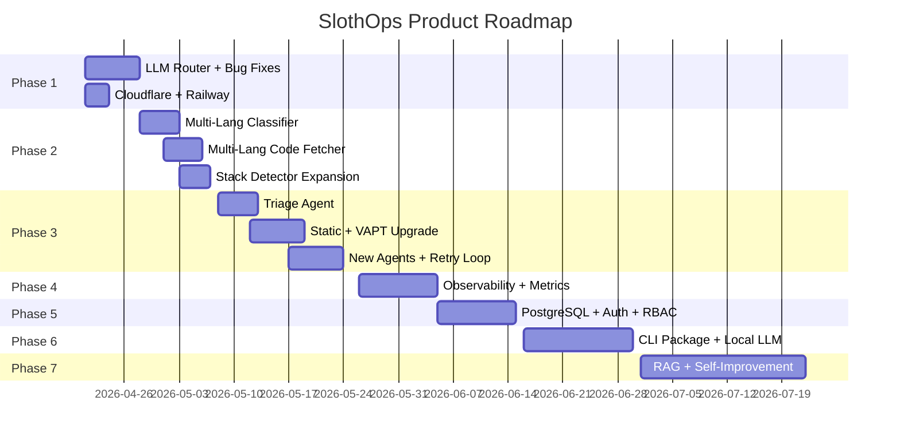

# SlothOps — Product Roadmap: Hackathon → Industry-Grade

> Phased plan to make SlothOps a robust, repo-agnostic product with industry-standard agentic QA.
> Based on full analysis of all 34 engine files.

---

## Current State Assessment


🟢 = Solid | 🟡 = Needs Hardening

**What works:** Full pipeline from Sentry error → PR → QA gate → rollback → auto-resolution.
**What's fragile:** LLM single-provider lock, classifier is JS-only, QA agents are shallow, no observability.

---

## Phase 1: Foundation Hardening (Week 1-2)
*Goal: Make every existing feature production-reliable*

### 1A. Multi-Provider LLM Router

**Problem:** 4 of 8 LLM call sites bypass `generate_with_fallback()`. Single Vertex AI dependency.

| File | What to Fix |
|:-----|:-----------|
| `genai_client.py` | Add OpenRouter/Together AI as fallback providers |
| `llm_fixer.py` | Route `generate_fix()`, `generate_infra_recommendation()`, `retry_fix_with_test_failure()` through `generate_with_fallback()` |
| `qa_agents/functionality.py` | Replace direct `client.models.generate_content()` with `generate_with_fallback()` |
| `config.py` | Make `GOOGLE_CLOUD_PROJECT` optional, add `OPENROUTER_API_KEY` |

**Architecture:**
```python
# genai_client.py — new provider chain
PROVIDER_CHAIN = [
    {"provider": "vertex",     "model": "gemini-2.5-pro"},
    {"provider": "openrouter", "model": "deepseek/deepseek-v3.2"},
    {"provider": "openrouter", "model": "qwen/qwen-2.5-coder-32b"},
    {"provider": "vertex",     "model": "gemini-2.5-flash"},
]

async def generate_with_fallback(prompt, ...) -> tuple[str, str]:
    for provider in PROVIDER_CHAIN:
        try:
            if provider["provider"] == "vertex":
                return await _call_vertex(prompt, provider["model"], ...)
            elif provider["provider"] == "openrouter":
                return await _call_openrouter(prompt, provider["model"], ...)
        except RateLimitError:
            continue
    raise RuntimeError("All providers exhausted")
```

### 1B. Fix Known Bugs

| Bug | File | Fix |
|:----|:-----|:----|
| PR body says "GPT-4o" | `github_automation.py:70` | Change to "Gemini via Vertex AI" |
| Style review indentation bug | `github_automation.py:181-183` | Fix loop scoping |
| `get_issue()` called with 2 args, needs 3 | `pipeline.py:213` | Add `workspace_id` param |
| Dead `gemini_api_key=""` param everywhere | `main.py`, `pipeline.py`, `qa_pipeline.py` | Remove dead parameter |
| Missing `PyJWT` in requirements | `requirements.txt` | Add `PyJWT>=2.8.0` |

### 1C. Stable Webhook Infrastructure

- Set up **Cloudflare Tunnel** for dev (`dev.slothdevs.com`)
- Deploy to **Railway** for persistent demo environment
- Add `Procfile`: `web: uvicorn main:app --host 0.0.0.0 --port $PORT`

**Deliverable:** Engine that survives Vertex AI outages, has zero known bugs, and has a stable URL.

---

## Phase 2: Universal Repo Support (Week 3-4)
*Goal: Work on any full-stack repo, not just Node/TS*

### 2A. Upgrade Classifier to Multi-Language

**Current:** `classifier.py` only recognizes JS/TS error types (`TypeError`, `ReferenceError`, etc.).

**Upgrade to support:**

```python
CODE_ERROR_TYPES = {
    # JavaScript/TypeScript
    "TypeError", "ReferenceError", "RangeError", "SyntaxError",
    # Python
    "AttributeError", "KeyError", "IndexError", "ValueError",
    "ImportError", "NameError", "ZeroDivisionError", "FileNotFoundError",
    # Java
    "NullPointerException", "ClassCastException", "ArrayIndexOutOfBoundsException",
    "IllegalArgumentException", "StackOverflowError",
    # Go (panic messages)
    "runtime error", "index out of range", "nil pointer dereference",
    # Rust
    "panic", "unwrap()", "thread 'main' panicked",
    # Ruby
    "NoMethodError", "ArgumentError", "RuntimeError",
}

INFRA_SIGNALS += [
    # Cloud-native
    "pod crash", "container exit", "ErrImagePull",
    # Database
    "deadlock", "lock wait timeout", "too many connections",
    # AWS/GCP/Azure
    "ThrottlingException", "ServiceUnavailableException",
]
```

### 2B. Upgrade Code Fetcher for Multi-Language

**Current:** `code_fetcher.py` `_extract_imports()` only parses JS/TS imports.

**Add parsers for:**

| Language | Import Pattern | Test Path Convention |
|:---------|:-------------|:-------------------|
| Python | `import x` / `from x import y` | `tests/test_*.py` |
| Go | `import "pkg/path"` | `*_test.go` (same dir) |
| Java | `import com.pkg.Class` | `src/test/java/...` |
| Rust | `use crate::module` | `#[cfg(test)]` in same file |
| Ruby | `require 'path'` / `require_relative` | `spec/*_spec.rb` |

### 2C. Upgrade Sentry Parser

**Current:** `sentry_parser.py` does `.js → .ts` conversion (line 112) which is JS-specific.

**Upgrade:** Make the extension mapping configurable per stack, or remove it and let the code fetcher handle it by trying both extensions.

### 2D. Expand Stack Detector

**Current:** `stack_detector.py` supports Node, Python, Go, Java, Rust (already good).

**Add:**
- **Ruby/Rails** detection (Gemfile)
- **PHP/Laravel** detection (composer.json)  
- **C#/.NET** detection (*.csproj, *.sln)
- **Monorepo support** — detect workspaces in `package.json`, `pnpm-workspace.yaml`

**Deliverable:** SlothOps correctly parses errors, fetches code, and generates fixes for Python, Go, Java, Rust, Ruby repos — not just Node/TS.

---

## Phase 3: Agentic QA Overhaul (Week 5-7)
*Goal: Industry-standard QA pipeline with intelligent triage*

### 3A. Triage Agent (NEW)

Add a **pre-pipeline agent** that analyzes the PR diff BEFORE choosing tools:

```python
# qa_pipeline.py — new triage step before tool selection
async def _triage_pr(changed_paths: list[str], changed_files: list[dict]) -> dict:
    """
    Returns:
      {
        "risk_level": "high" | "medium" | "low",
        "categories": ["api_change", "auth_code", "dependency_update", ...],
        "skip_agents": ["stress_test", "performance"],  # skip if irrelevant
        "enhanced_agents": ["vapt"],  # run with deeper prompts
        "reason": "PR only modifies CSS and markdown files"
      }
    """
```

**Rules (no LLM needed — pure heuristic):**

| Changed Files Pattern | Risk | Run | Skip |
|:---------------------|:-----|:----|:-----|
| Only `.md`, `.css`, `.svg` | Low | Static Analysis only | All others |
| `package.json` / `requirements.txt` | Medium | VAPT only | Stress, Performance |
| Auth/payment/security paths | High | ALL + enhanced VAPT | None |
| New API routes/endpoints | High | ALL agents | None |
| Test files only | Low | Regression only | All others |

### 3B. Upgrade Static Analysis Agent

**Current:** Only runs lint commands from `stack_config`.

**Add:**

```python
# static_analysis.py — upgraded tool chain
UNIVERSAL_TOOLS = [
    {
        "name": "Semgrep",
        "cmd": "semgrep scan --config=auto --json --quiet .",
        "parser": _parse_semgrep_json,
        "install": "pip install semgrep",
    },
]

STACK_TOOLS = {
    "typescript": [
        {"name": "ESLint", "cmd": "...", ...},
        {"name": "TypeScript Compiler", "cmd": "npx tsc --noEmit", ...},
    ],
    "python": [
        {"name": "Ruff", "cmd": "ruff check . --output-format=json", ...},
        {"name": "mypy", "cmd": "mypy . --ignore-missing-imports", ...},
    ],
    "go": [
        {"name": "go vet", "cmd": "go vet ./...", ...},
        {"name": "staticcheck", "cmd": "staticcheck ./...", ...},
    ],
}
```

### 3C. Upgrade VAPT Agent

**Current:** Only `npm audit` / `pip-audit`.

**Add:**

| Tool | What It Does | Languages |
|:-----|:------------|:----------|
| **Trivy** | Filesystem + container vulnerability scanner | All |
| **OSV-Scanner** | Google's open-source vulnerability DB | All |
| **Bandit** | Python-specific security linter | Python |
| **gosec** | Go security checker | Go |
| **Brakeman** | Rails security scanner | Ruby |

```python
# vapt.py — add Trivy as universal scanner
UNIVERSAL_SCANNERS = [
    {
        "name": "Trivy",
        "cmd": "trivy fs --scanners vuln,secret --format json .",
        "parser": _parse_trivy_json,
    },
]
```

### 3D. Upgrade Functionality Agent

**Current:** LLM generates tests and runs them. Bypasses `generate_with_fallback()`.

**Upgrades:**
1. Route through `generate_with_fallback()` (bug fix)
2. Add **mutation testing** via Stryker (JS/TS) or mutmut (Python) to verify test quality
3. Add **contract testing** — if the PR modifies API routes, generate API schema validation tests

### 3E. Upgrade Stress Test Agent

**Current:** Uses `autocannon` with 10 connections for 5 seconds.

**Upgrades:**
1. Replace with **k6** for scriptable load scenarios
2. Auto-discover API routes from code (Express router, FastAPI decorators, etc.)
3. Test each discovered endpoint, not just root

### 3F. New Agent: Dependency Health Check

```python
# qa_agents/dependency_health.py
async def run_dependency_health(repo_dir: str, stack_config: dict) -> dict:
    """
    - Check for outdated dependencies (npm outdated, pip list --outdated)
    - Check license compatibility (license-checker for npm)
    - Check for deprecated packages
    - Bundle size impact analysis (for frontend)
    """
```

### 3G. New Agent: Dead Code Detection

```python
# qa_agents/dead_code.py
async def run_dead_code_detection(repo_dir: str, stack_config: dict) -> dict:
    """
    - JS/TS: knip or ts-prune
    - Python: vulture
    - Go: deadcode (golang.org/x/tools/cmd/deadcode)
    """
```

### 3H. QA Auto-Resolution Retry Loop

**Current:** `_run_qa_resolution()` in `main.py` pushes fixes but never verifies.

**Upgrade:** Match the pattern from `resolution.py`:

```python
MAX_QA_RESOLUTION_ATTEMPTS = 3

async def _run_qa_resolution(report, workspace_id, attempt=1):
    # ... generate and push fixes ...
    # After push triggers re-run of QA:
    # If QA fails again and attempt < MAX, the webhook handler calls this again
```

**Deliverable:** QA pipeline with 8+ agents, intelligent triage, multi-language SAST, and self-healing retry loop.

---

## Phase 4: Observability & Reliability (Week 8-9)
*Goal: Know what's happening inside the engine at all times*

### 4A. Structured Logging with OpenTelemetry

Replace basic `logging` with structured traces:

```python
# Each pipeline run gets a trace_id
# Each stage (redact, classify, fix, PR, QA) is a span
# LLM calls track: model, tokens_in, tokens_out, latency_ms, cost
```

### 4B. Pipeline Metrics Dashboard

Track and expose via `/api/metrics`:

| Metric | Purpose |
|:-------|:--------|
| `pipeline.total_runs` | Total issues processed |
| `pipeline.fix_success_rate` | % of fixes that pass QA |
| `pipeline.avg_time_to_fix` | Sentry alert → PR created time |
| `llm.calls_by_provider` | Which provider is being used most |
| `llm.fallback_rate` | How often primary fails |
| `qa.agent_pass_rates` | Per-agent success % |
| `rollback.total` | Production rollbacks triggered |
| `resolution.success_rate` | % of auto-resolutions that worked |

### 4C. Rate Limit Intelligence

Replace the blunt `_llm_lock` (global mutex) with a **token bucket per provider**:

```python
class ProviderRateLimiter:
    def __init__(self, rpm: int, tpm: int):
        self.rpm = rpm  # requests per minute
        self.tpm = tpm  # tokens per minute
        self._request_bucket = TokenBucket(rpm, 60)
        self._token_bucket = TokenBucket(tpm, 60)
    
    async def acquire(self, estimated_tokens: int):
        await self._request_bucket.acquire(1)
        await self._token_bucket.acquire(estimated_tokens)
```

### 4D. Error Recovery & Circuit Breaker

Wrap each pipeline stage with circuit breaker pattern:
- If a stage fails 3 times in 5 min → open circuit → skip stage + log
- Auto-close after 2 min cooldown

**Deliverable:** Full observability, smart rate limiting, and fault-tolerant pipeline stages.

---

## Phase 5: Multi-Tenant SaaS Hardening (Week 10-11)
*Goal: Multiple teams can use SlothOps simultaneously*

### 5A. Database Migration: SQLite → PostgreSQL

**Current:** aiosqlite with file-based DB. Good for MVP, doesn't scale.

**Migration path:**
1. Abstract `database.py` behind a provider interface
2. Add `asyncpg` provider for PostgreSQL
3. Use `DATABASE_URL` env var to switch between SQLite (dev) and PostgreSQL (prod)
4. Add Alembic for schema migrations

### 5B. Auth & RBAC Upgrade

**Current:** Basic JWT with 7-day expiry, single `admin` role.

**Add:**
- Refresh tokens
- Role-based access: `admin`, `developer`, `viewer`
- API key auth for CI/CD integrations
- Rate limiting per workspace

### 5C. Multi-Repo Support

**Current:** `pipeline.py` line 178 takes `installed_repos[0]` — always first repo.

**Fix:** Store target repo per workspace in the integrations table. Let dashboard select which repo to monitor.

### 5D. Workspace Isolation

Ensure all DB queries are workspace-scoped (most already are, verify edge cases).

**Deliverable:** Production-grade multi-tenant SaaS with proper auth, database, and repo management.

---

## Phase 6: CLI & Local-First Mode (Week 12-14)
*Goal: `pip install slothops` for any developer*

### 6A. Package Structure

```
slothops/
├── cli/
│   ├── __init__.py
│   ├── main.py          # Click/Typer CLI entrypoint
│   ├── commands/
│   │   ├── init.py      # slothops init
│   │   ├── qa.py        # slothops qa
│   │   ├── scan.py      # slothops scan
│   │   ├── fix.py       # slothops fix <error>
│   │   └── auth.py      # slothops auth login
│   └── config.py        # .slothops.yml loader (reuse stack_detector.py)
├── agents/              # Reuse qa_agents/ directly
├── core/
│   ├── genai_client.py  # Multi-provider (reuse)
│   ├── classifier.py    # Reuse
│   └── code_fetcher.py  # Local filesystem version
└── setup.py / pyproject.toml
```

### 6B. Local LLM Support

For free-tier users who don't have API keys:

```python
# genai_client.py — add Ollama provider
PROVIDERS.append({
    "provider": "ollama",
    "model": "qwen2.5-coder:32b",
    "base_url": "http://localhost:11434",
})
```

### 6C. GitHub PAT Mode

Free-tier users use their own GitHub PAT instead of the GitHub App:

```python
# CLI creates PRs via PAT
$ slothops fix --github-token ghp_xxx
```

**Deliverable:** Installable CLI package that runs QA locally, creates fixes, and optionally upgrades to cloud.

---

## Phase 7: Advanced Agent Intelligence (Week 15-18)
*Goal: Agents that learn and improve over time*

### 7A. Fix Confidence Calibration

Track actual outcomes of LLM fixes:

```
Fix generated (confidence: high) → PR merged → No recurrence in 7 days → ✅ Correct prediction
Fix generated (confidence: high) → PR merged → Recurrence → ❌ Overconfident
```

Use this data to calibrate future confidence scores.

### 7B. Codebase Memory (RAG)

Instead of fetching only the crash file + imports, build a **vector index** of the repo:

```python
# On first run per repo:
# 1. Parse all files with tree-sitter
# 2. Extract function signatures + docstrings
# 3. Embed with a small model (e.g., text-embedding-3-small)
# 4. Store in ChromaDB/Qdrant
# 5. On each error, retrieve top-k relevant functions
```

This gives the LLM much better context for multi-file fixes.

### 7C. Agent Self-Improvement

After each QA cycle, log:
- Which agents found real issues vs false positives
- Which auto-resolution fixes actually worked
- Time spent per agent

Use this to dynamically adjust agent thresholds and triage rules.

### 7D. Cross-PR Learning

If the same type of fix is generated 3+ times across different PRs (e.g., "add null check before accessing property"), suggest it as a **codebase-wide refactor** recommendation.

**Deliverable:** Agents that get smarter over time with calibrated confidence, repo memory, and cross-PR pattern detection.

---

## Summary: Phase Timeline



---

## Priority Matrix

| Phase | Impact | Effort | Do First? |
|:------|:-------|:-------|:----------|
| **Phase 1** — Foundation | 🔴 Critical | Low (1 week) | ✅ YES — blocks everything |
| **Phase 2** — Multi-Lang | 🟡 High | Medium (2 weeks) | ✅ YES — needed for "any repo" |
| **Phase 3** — QA Overhaul | 🔴 Critical | High (3 weeks) | ✅ YES — core differentiator |
| **Phase 4** — Observability | 🟡 High | Medium (2 weeks) | After Phase 3 |
| **Phase 5** — SaaS | 🟢 Medium | High (2 weeks) | After Phase 4 |
| **Phase 6** — CLI | 🟢 Medium | High (3 weeks) | Post-funding |
| **Phase 7** — Intelligence | 🟢 Future | Very High (3 weeks) | Post-launch |

> [!IMPORTANT]
> **Phases 1-3 are your MVP.** Complete these and you have an industry-standard product that works on any full-stack repo with intelligent QA. Phases 4-7 are growth features.

---

## Files Modified Per Phase (Quick Reference)

| Phase | New Files | Modified Files |
|:------|:---------|:--------------|
| **1** | `Procfile` | `genai_client.py`, `llm_fixer.py`, `config.py`, `functionality.py`, `github_automation.py`, `pipeline.py`, `requirements.txt` |
| **2** | — | `classifier.py`, `code_fetcher.py`, `sentry_parser.py`, `stack_detector.py` |
| **3** | `qa_agents/triage.py`, `qa_agents/dependency_health.py`, `qa_agents/dead_code.py` | `qa_pipeline.py`, `static_analysis.py`, `vapt.py`, `functionality.py`, `stress_test.py`, `main.py` |
| **4** | `telemetry.py`, `rate_limiter.py` | `genai_client.py`, `pipeline.py`, `main.py` |
| **5** | `db_postgres.py`, `migrations/` | `database.py`, `auth.py`, `models.py`, `main.py` |
| **6** | `cli/` package (8+ files) | `setup.py`/`pyproject.toml` |
| **7** | `rag_index.py`, `calibration.py` | `llm_fixer.py`, `qa_pipeline.py` |
